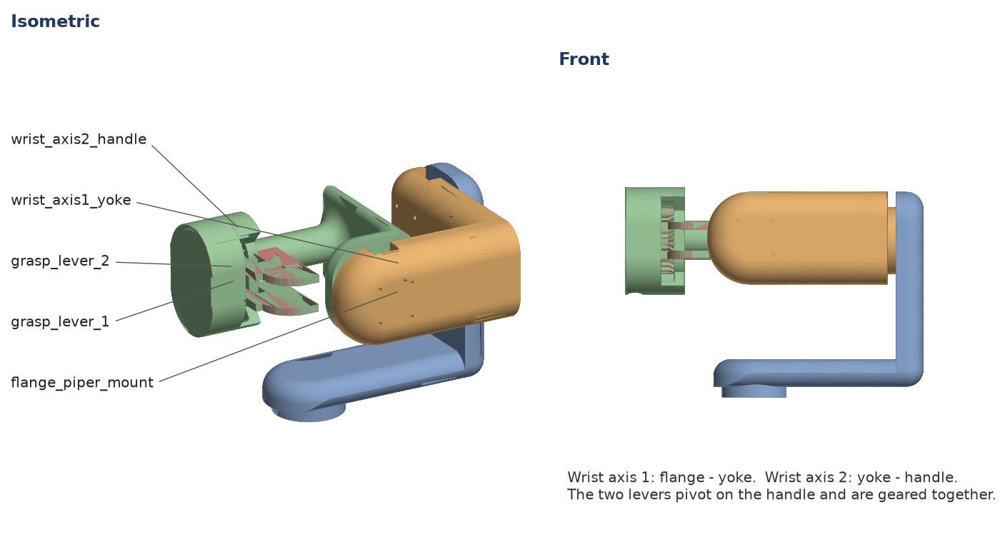
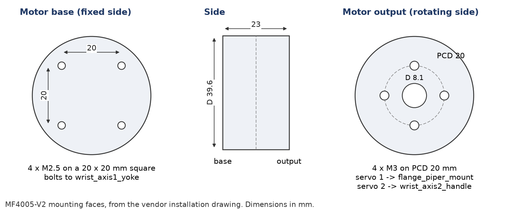
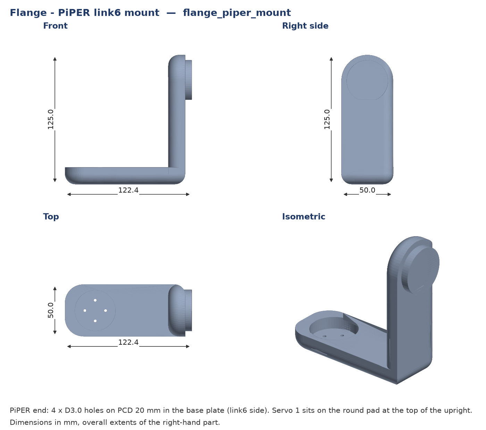
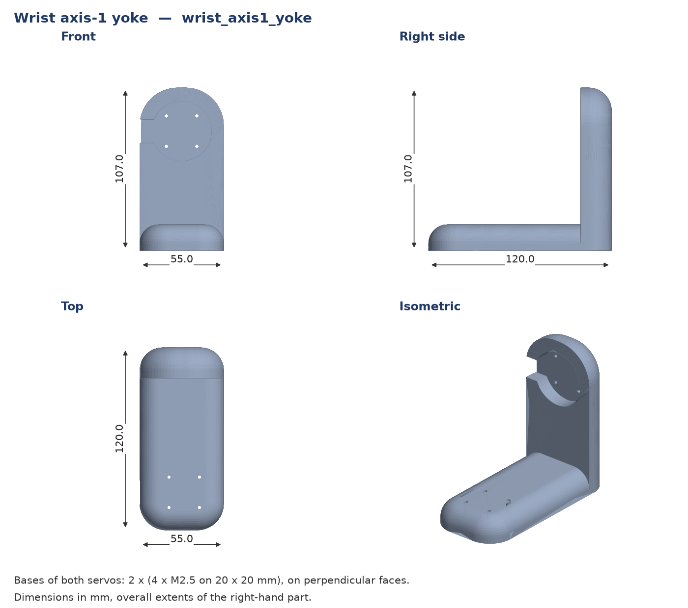
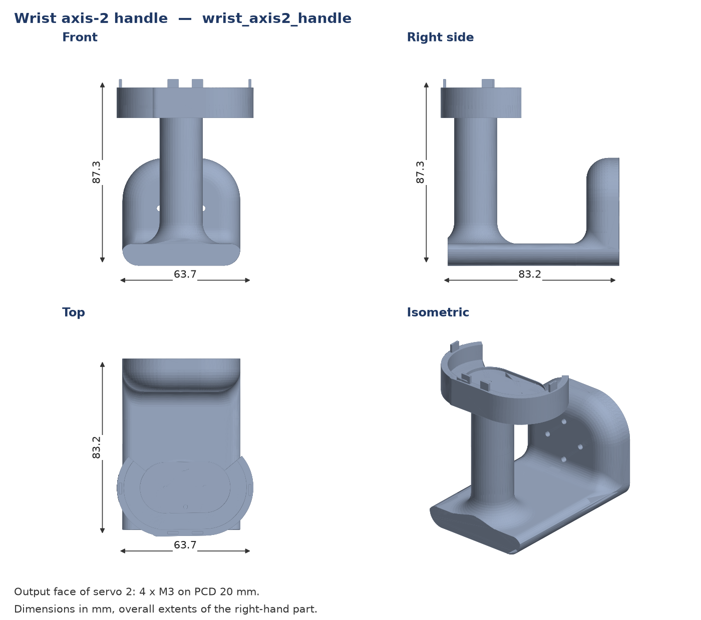
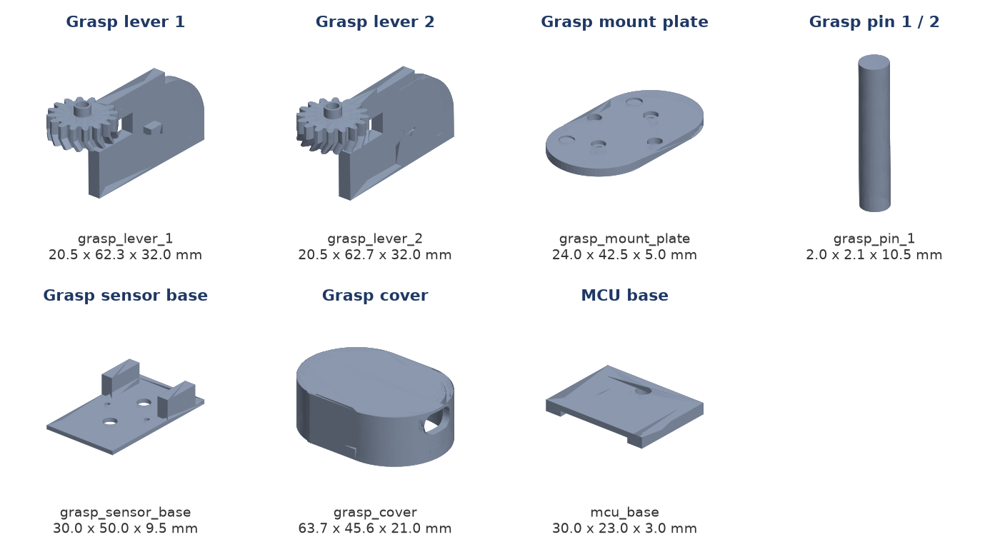

# Assembly guide — ROSOTA leader gripper (2-DOF wrist + grasp levers)

## 0. Before you start

Print every part in `STL/printable_right/` for a right-hand unit, or
`STL/printable_left/` for a left-hand unit. A full console needs one of each.

| setting | value |
|---|---|
| material | PLA (Bambu PLA Basic) |
| layer height | 0.20 mm |
| walls / infill | 2 walls, 15 % cubic infill |
| supports | on |

Fig. 1 shows the assembled right-hand gripper with every printed part named.

## 1. Flange to the arm

1. Bolt `flange_piper_mount` onto the PiPER `link6` face through the four
   holes on PCD 20 mm in its base plate (Fig. 3).
2. Check that the flange seats flat — this joint is fixed in the URDF, so any
   tilt here shows up as a constant offset in every wrist reading.

## 2. Wrist axis 1

The MF4005-V2 mounting faces are shown in Fig. 2.

1. Seat the first **MF4005-V2** servo in `wrist_axis1_yoke`, motor base against
   the yoke.
2. Attach the servo output to `flange_piper_mount`.
3. Set the motor's CAN ID **before** it goes into the bundle — the right wrist
   uses IDs **2 and 4**, the left wrist IDs **2 and 6**. MF4005 replies on the
   same arbitration ID it is queried on (`0x140+ID`), so two motors sharing an
   ID on one bus cannot be told apart afterwards.

## 3. Wrist axis 2

1. Seat the second MF4005-V2 in `wrist_axis1_yoke`.
2. Attach `wrist_axis2_handle` to its output.
3. Route both motor cables along the outside of the handle.

## 4. Grasp module

1. Fit `grasp_lever_1` and `grasp_lever_2` onto `grasp_mount_plate` with
   `grasp_pin_1` / `grasp_pin_2`.
2. Mesh the lever gear teeth so the two levers move symmetrically. The console
   software reads the pair as a single grasp angle, so a half-tooth offset is a
   permanent bias.
3. Mount the magnetic rotary encoder on the lever shaft. Set the magnet gap so
   the reading changes smoothly across the full lever travel — a reading that
   never moves by more than one LSB means the magnet is too far away or not
   centred.
4. Fit `grasp_cover`.

## 5. Electronics

1. Mount the **Seeed XIAO nRF52840 Sense** on `mcu_base`.
2. Wire the encoder to the XIAO.
3. The XIAO enumerates as USB `2886:8045` and streams the grasp angle in
   degrees over USB CDC.

## 6. Checks before use

- [ ] Both MF4005 answer on their intended IDs, on the intended bus.
- [ ] Bus voltage reads 12.3–12.5 V under load.
- [ ] The encoder sweeps its full range over the lever travel, with no jumps.
- [ ] Assembled gripper mass is close to 207 g — a large difference means a part
      was printed with different settings, and the URDF inertials will be off.

## 7. Reference drawings

Overall dimensions of the right-hand parts. The left-hand parts in
`STL/printable_left/` are their mirror images.

